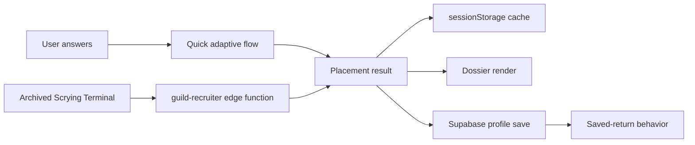

# Data Flow Map

This document traces the main Vox Mana data paths from source content through generated runtime artifacts, browser state, backend calls, and local tooling.

## Faction And Placement Artifacts

| Source | Transform | Output | Consumer |
|---|---|---|---|
| `data/identity-layers.json` | Local faction artifact builder validates color and expression metadata, then merges it into runtime identity blocks. | `data/factions.json`, `data/placement-model.json`, `data/placement-model.schema.json`, Supabase `faction-context.ts` | Dossier rendering, adaptive reading, and archived terminal prompt context. |
| `data/raw-factions/*/*.profile.json` | Local faction artifact builder reads faction identity, profile, source, and claim metadata. | `data/placement-model.json`, Supabase `faction-context.ts` | Adaptive reading and the archived Scrying Terminal prompt context. |
| `data/raw-factions/*/*.placement.json` | Build script normalizes calibration, good/poor indicators, discriminator questions, and lateral inhibition targets. | `data/placement-model.json` | `assets/js/adaptive-placement.js`. |
| `data/factions.json` | Build script enriches `_meta` while preserving display data. | `data/factions.json` | `assets/js/index.js` dossier rendering. |
| Build-time constants in `research/build-faction-artifacts.mjs` | Raw ids map to runtime keys, biological priors, known inhibition, question bank, schema. | `data/placement-model.json`, `data/placement-model.schema.json`, `supabase/functions/guild-recruiter/faction-context.ts` | Frontend and edge function. |

The authoritative edit path is raw/display data first, then `npm run build:factions` from this repo. Generated artifacts should not be hand-edited unless explicitly repairing generated output.

## Browser Runtime State

| Data | Owner | Storage | Purpose |
|---|---|---|---|
| `APP_STATE` | `assets/js/index.js` | In-memory only | Current factions, model, identity-layer catalog, quick answers, adaptive state, active result, active view, interview state, starter profile. Terminal UI state stays dormant unless the feature flag is enabled. |
| `VM_SESSION` | `assets/js/shared.js` | In-memory plus session storage | Auth/session profile, username, avatar, current interview history/result, saved profile result. Interview state stays dormant unless the feature flag is enabled. |
| Cached placement result | `assets/js/shared.js` | `sessionStorage` key `vm_cached_result` | Guest and post-OAuth result recovery. |
| Pending OAuth save | `assets/js/shared.js` | `sessionStorage` key `vm_pending_result` | Holds result while Google OAuth redirect completes. |
| Interview session bucket | `assets/js/shared.js` | `sessionStorage` key `vm_interview_session_id` | Stable client throttle/session id for edge function calls. |
| Reduce motion | `assets/js/reduce-motion.js`, `assets/js/vm-topbar.js` | `localStorage` key `vm_reduce_motion` | Shared motion preference. |
| Home resume chip | `assets/js/home.js` | Reads several legacy/current local storage keys | Displays cached faction resume affordance when available. |
| Archscry-to-Maze handoff | `assets/js/index.js`, `research/research-init.js` | `localStorage` key `vm_archscry_maze_handoff_v1` plus Maze query params | Preserves originating dossier, active fit, return URL, `plainReadingQuery`, executable `operatorQuery`, stable `pathType`, and return-banner dismissal state when opening Maze paths. |
| Maze card stash | `research/research-init.js` | `localStorage` key `vm_maze_card_stash_v1` | Lightweight local card stash with Commander Ideas, support cards, and maybe finds. |
| Command panel filters | External command panel | `localStorage` keys `cp.*` | Local panel lane/status/search/page preferences. |

## Placement Result Flow

All result-producing paths should converge on the versioned placement shape documented in [Data Contracts](../reference/data-contracts.md).

The mono foundation pass adds layered `identity` blocks to primary and adjacent matches. `color_weights` remains optional until scoring can produce it without approximation.

## External Services

| Service | Caller | Endpoint family | Data sent | Data received |
|---|---|---|---|---|
| Supabase Auth and Database | `assets/js/shared.js` | Browser Supabase client | OAuth request, profile upsert/update/select | Session, user metadata, profile row, saved placement. |
| Supabase Edge Function | `assets/js/shared.js` | `/functions/v1/guild-recruiter` | Message, sanitized history, session id, starter profile, optional current result | Interview turn response or normalized decision result when the archived terminal path is enabled. |
| Anthropic | `supabase/functions/guild-recruiter/index.ts` | `https://api.anthropic.com/v1/messages` | Generated system prompt and sanitized messages | JSON text to parse as interview turn response when the archived terminal path is enabled. |
| Scryfall Search | `research/research-search.js` | `/cards/search` | Query, unique, order, page | Card result pages and pagination URLs. |
| Scryfall Named | `research/research-search.js`, `assets/js/index.js` | `/cards/named` | Fuzzy card name | Exact card detail or image/link metadata. |
| Scryfall Random | `research/research-search.js` | `/cards/random` | Optional query | Random fallback/no-results card. |

## Supabase Profile Persistence

`assets/js/shared.js` saves compatibility fields plus the rich result:

| Field | Source |
|---|---|
| `guild`, `guild_name`, `runner_up`, `confidence`, `decree`, `scores`, `taken_at` | Normalized placement result and display profile. |
| `display_name`, `avatar_url` | Supabase auth metadata and profile fallback. |
| `placement_result` | Full normalized result; treated as saved-return source of truth. |

Legacy rows with `guild` and `scores` but no `placement_result` are converted by `makeLegacyPlacementResult`.

## Research Workspace Data

| Source | Transform | Output |
|---|---|---|
| `research/scryfall-parser-seed-2026.json` | `createDictionaryFromSeed` expands triggers into dictionaries. | Runtime parser dictionary. |
| Natural language input | `parseScryfallNaturalLanguage` | Structured query, reason, confidence, warnings, assumptions, alternatives. |
| Raw syntax input | `prepareRawSyntaxQuery` | Cleaned query and optional OR alternative diagnostics. |
| Visual Builder filters | `buildVisualBuilderQuery` | Scryfall query fragments for color, type, format, rarity, mana value, and keywords. |
| Scryfall responses | `research-init.js` render helpers | Result grid, modal detail, no-results state, recent searches. |

## Scryfall Bulk And Discovery Data

| Source | Transform | Output |
|---|---|---|
| Scryfall `/bulk-data` endpoint | `scripts/download-scryfall-bulk.mjs` selects `oracle_cards`, validates JSON, and writes ignored raw files. | `data/scryfall/raw/oracle-cards.json`, `data/scryfall/raw/bulk-manifest.json` |
| `oracle-cards.json` plus `data/taxonomy/vox-mana-tags.json` | `scripts/build-scryfall-indexes.mjs` emits categorized tags, lore tones, Commander candidates, color summaries, and mechanic summaries. | `data/scryfall/indexes/*.json` |
| `card-flavor-index.json` | Archscry result helpers select short flavor echoes by color identity, reading tags, and lore-tone fit. | Flavor Echoes result section with Scryfall links and "why it echoes" copy. |
| `commander-index.json` | Archscry Commander preview enrichment checks local metadata after curated Commander Compass candidates are selected. | Commander type/color/tag metadata beside preview cards. |
| Placement cache/profile result or Archscry handoff | Maze reading-path builder derives optional query seeds. Archscry-originated links seed Plain Reading display text from `plainReadingQuery` while executing `operatorQuery`. | `From Your Reading` sidebar paths, live Scryfall search results, copy/mode continuity, and a dismissible return-to-dossier banner only when placement context exists. |

## Command Panel Data

| Data | Location | Owner |
|---|---|---|
| Command manifest | External tools workspace | Local command allowlist. |
| External Apocrypha dry-run report | `C:\dev\projectFiles\lore\.cache\apocrypha-digest\research\apocrypha-index\dry_run_report.json` | Command panel inventory import. |
| External source manifest | `C:\dev\projectFiles\lore\.cache\apocrypha-digest\research\apocrypha-index\source_manifest.json` | Command panel inventory import. |
| Persistent panel state | `C:\dev\projectFiles\voxmana-tools\test-results\command-panel\state.json` | Selected/reviewed/skipped/running inventory states. |
| Run logs | `C:\dev\projectFiles\voxmana-tools\test-results\command-panel\runs\` | stdout/stderr/run records for command executions. |

## Test And Report Outputs

| Command | Output |
|---|---|
| `npm test` | Console PASS/FAIL for parser, builder, mode, syntax, and placement tests. |
| `npm run test:placement` | Console PASS/FAIL for adaptive model invariants and golden paths. |
| `npm run test:bias` | Writes seeded-random bias report under `test-results/quick-reading-bias/`. |
| `npm run test:bias:all` | Writes exhaustive/golden bias report under `test-results/quick-reading-bias/`. |
