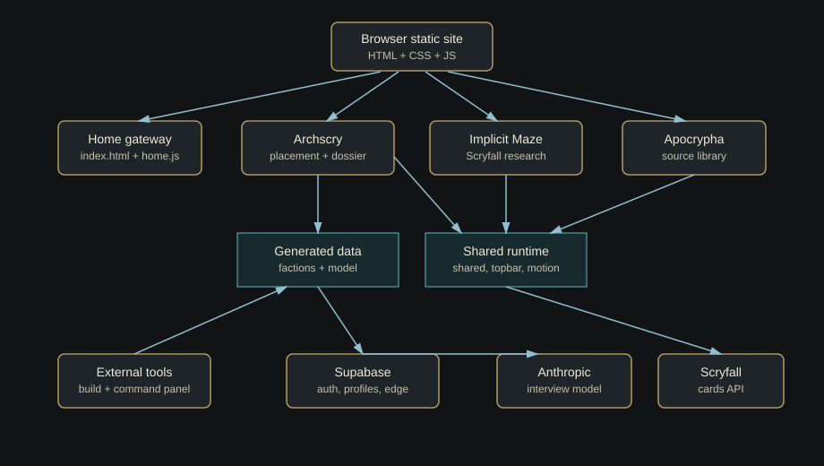
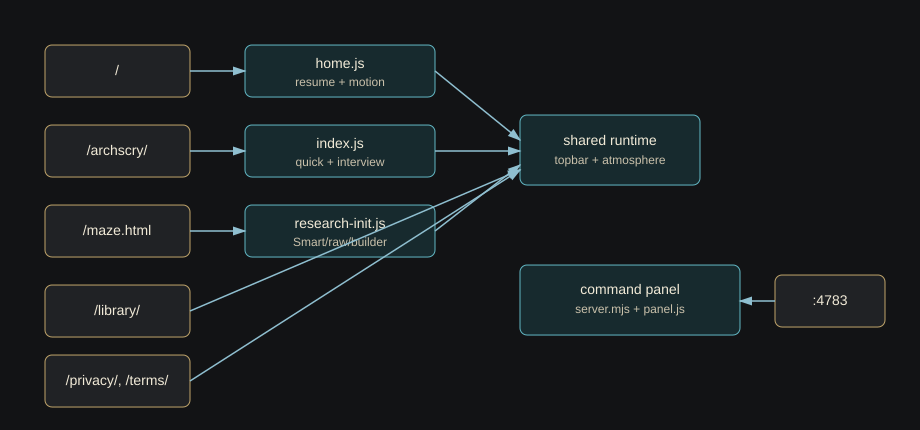
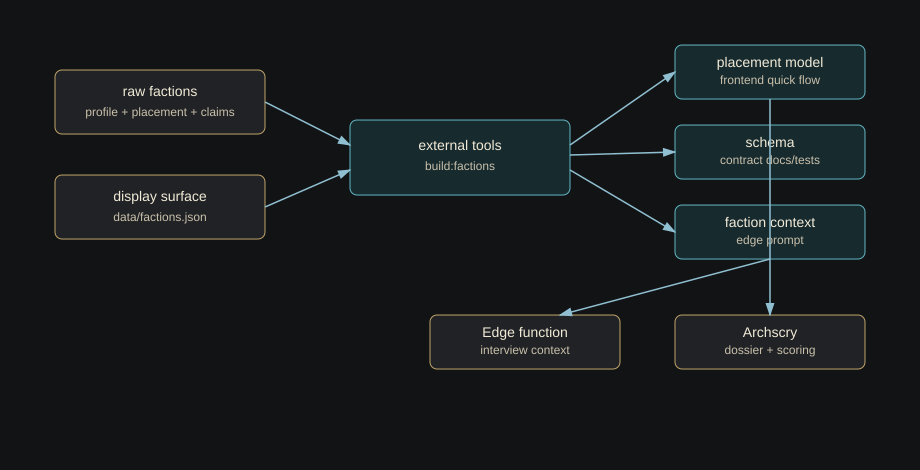
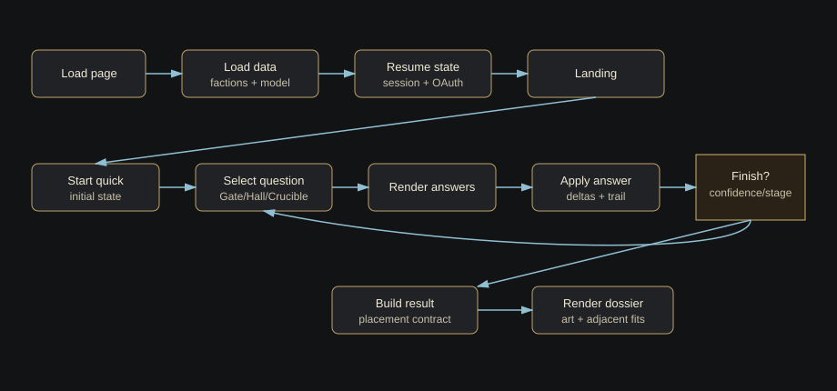
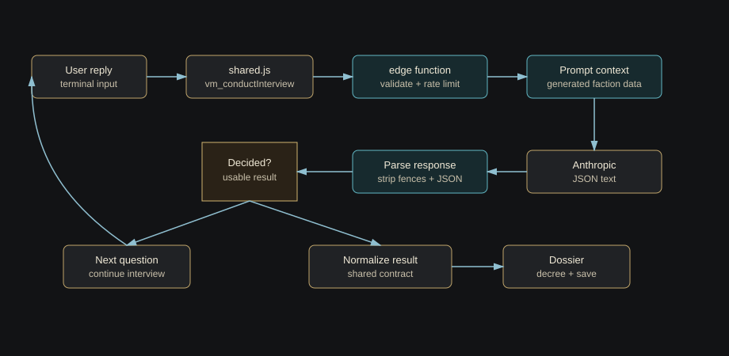
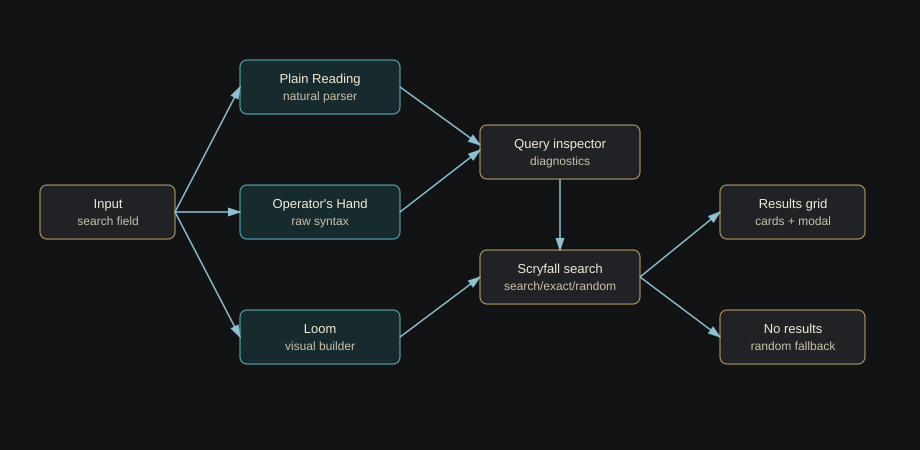
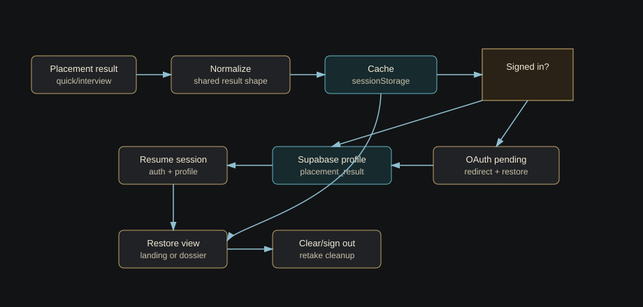
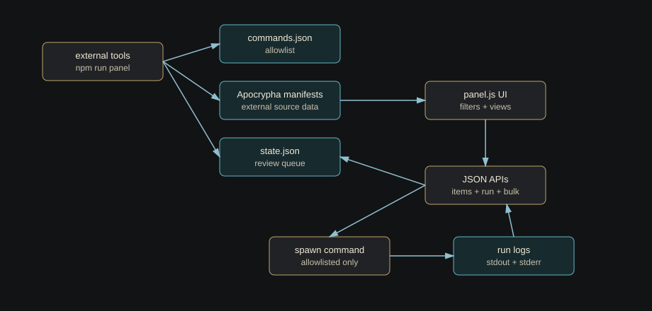

# Diagrams

The Mermaid files are the editable diagram sources. The SVG files are static companions for quick browsing and sharing. Keep each `.mmd` and `.svg` pair conceptually aligned when changing architecture, routes, data flow, or runtime ownership.

| Diagram | Mermaid Source | Static SVG |
|---|---|---|
| Project architecture | [project-architecture.mmd](diagrams/project-architecture.mmd) | [project-architecture.svg](diagrams/project-architecture.svg) |
| Route map | [route-map.mmd](diagrams/route-map.mmd) | [route-map.svg](diagrams/route-map.svg) |
| Data pipeline | [data-pipeline.mmd](diagrams/data-pipeline.mmd) | [data-pipeline.svg](diagrams/data-pipeline.svg) |
| Archscry quick flow | [archscry-quick-flow.mmd](diagrams/archscry-quick-flow.mmd) | [archscry-quick-flow.svg](diagrams/archscry-quick-flow.svg) |
| Archived Scrying Terminal flow | [scrying-terminal-flow.mmd](diagrams/scrying-terminal-flow.mmd) | [scrying-terminal-flow.svg](diagrams/scrying-terminal-flow.svg) |
| Maze Scryfall flow | [maze-scryfall-flow.mmd](diagrams/maze-scryfall-flow.mmd) | [maze-scryfall-flow.svg](diagrams/maze-scryfall-flow.svg) |
| Persistence and auth flow | [persistence-auth-flow.mmd](diagrams/persistence-auth-flow.mmd) | [persistence-auth-flow.svg](diagrams/persistence-auth-flow.svg) |
| Command panel flow | [command-panel-flow.mmd](diagrams/command-panel-flow.mmd) | [command-panel-flow.svg](diagrams/command-panel-flow.svg) |

## Project Architecture

## Route Map

## Data Pipeline

## Archscry Quick Flow

## Archived Scrying Terminal Flow

## Maze Scryfall Flow

## Persistence And Auth Flow

## Command Panel Flow

