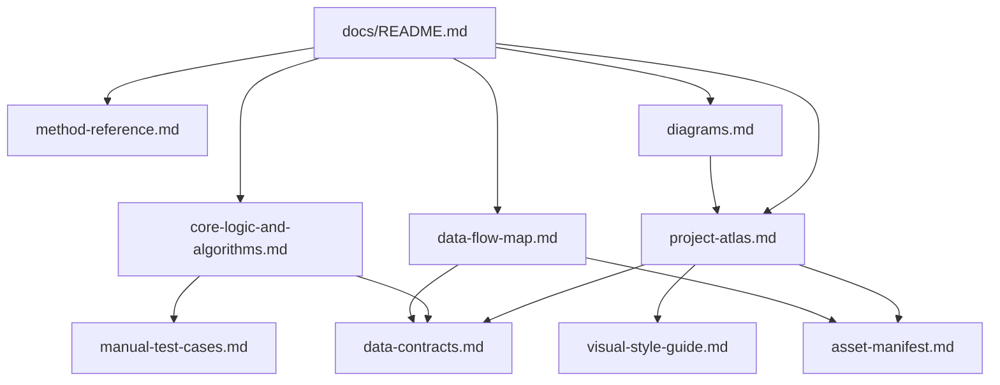

# Spec Index

This index explains the existing documentation set and how it connects to the technical atlas.

| Spec | Role | Use When |
|---|---|---|
| [README](README.md) | Developer docs hub for the atlas. | Orienting to the documentation set. |
| [Project Atlas](project-atlas.md) | High-level system map. | Finding routes, entrypoints, scripts, runtime layers, and artifacts. |
| [Method Reference](method-reference.md) | Javadoc-equivalent function/API list. | Looking up functions, exports, globals, handlers, and endpoint surfaces. |
| [Core Logic And Algorithms](core-logic-and-algorithms.md) | Behavioral breakdowns. | Understanding placement, parsing, persistence, generation, and command execution logic. |
| [Data Flow Map](data-flow-map.md) | Data lineage and storage map. | Tracing raw inputs to generated artifacts, browser state, Supabase, Scryfall, archived terminal calls, and test output. |
| [Diagrams](diagrams.md) | Visual maps. | Reading architecture, route, flow, and data diagrams. |
| [Data Contracts](data-contracts.md) | Runtime data shapes. | Updating placement result shape, generated model shape, or Supabase profile expectations. |
| [Manual Test Cases](manual-test-cases.md) | Human QA flow. | Verifying quick reading, archived terminal, save/resume, failures, and mobile sanity. |
| [Visual Style Guide](visual-style-guide.md) | Art direction and UI language. | Creating or refactoring pages/assets without losing the Vox Mana aesthetic. |
| [Asset Manifest](asset-manifest.md) | Asset source and generation queue. | Regenerating backgrounds, textures, overlays, icons, or architecture fragments. |
| [Implementation Notes](implementation-notes.md) | Asset implementation notes. | Applying generated assets through CSS and component classes. |
| [Move Into Repo](move-into-repo.md) | Migration note. | Checking what was moved into this repo during earlier consolidation. |
| [Workflow](workflow.md) | Kanban and PR review workflow. | Opening issues, branches, PRs, and local review passes. |

## Spec Dependency Map

## Maintenance Rules

- Update [Method Reference](method-reference.md) when adding, removing, or renaming named functions, exported constants, globals, or local endpoints.
- Update [Data Flow Map](data-flow-map.md) when generated artifacts, storage keys, external APIs, or Supabase fields change.
- Update [Core Logic And Algorithms](core-logic-and-algorithms.md) when placement scoring, parser rules, query-builder behavior, interview normalization, or command execution changes.
- Update [Diagrams](diagrams.md) and the matching `docs/diagrams/*.mmd` and `*.svg` files when route, data, or runtime boundaries change.
